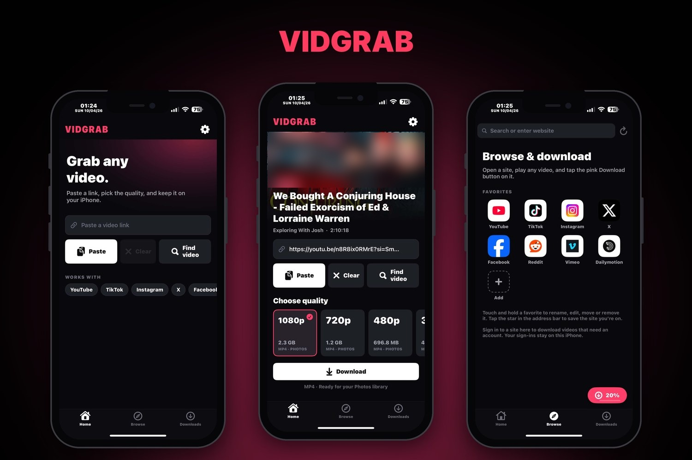
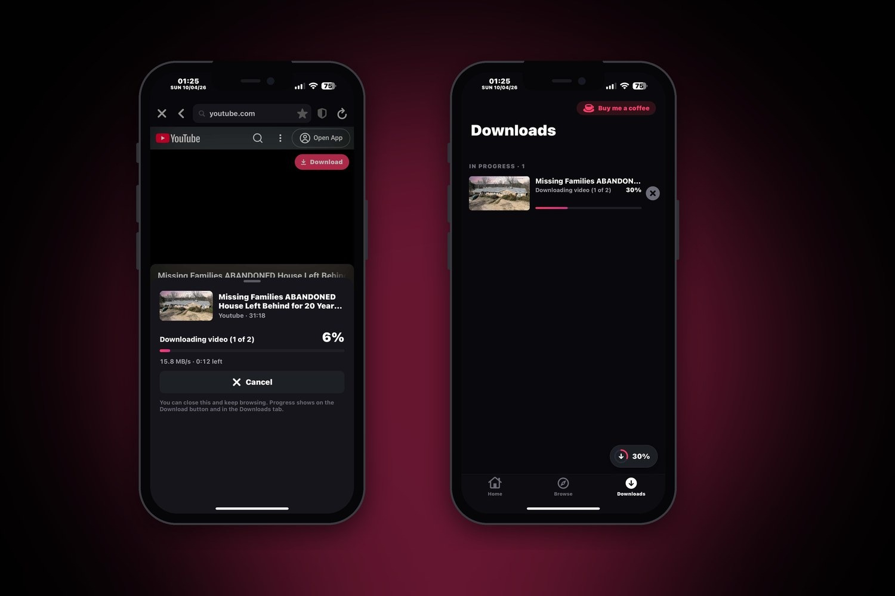

# VidGrab

VidGrab is a video downloader for iPhone and iPad. Paste a link, choose your preferred quality, and download. You can also browse directly in the built-in browser, play a video, and use the Download button when it appears.

I made VidGrab to keep video downloading simple and straightforward, without requiring jailbreak tweaks or a bunch of additional packages.

Made by T4MAG0 · [github.com/iamjhe08](https://github.com/iamjhe08)

## Screenshots

<p align="center">
  
</p>
<p align="center">
  
</p>

## What it can do

- Download from YouTube and lots of other sites, up to 4K when the site has it
- Browse sites inside the app and grab whatever video is playing
- Ad blocker in the browser
- Run up to 10 downloads at the same time
- Saves videos as MP4 so they play right away and can go into Photos
- Save just the sound as MP3 or M4A
- Keeps YouTube videos in their original language instead of a dubbed track
- Favorites you can add, rename and rearrange
- Clear the cache by hand or automatically every time the app opens
- A "Fix playback" button for videos that won't play properly

## Install

1. Go to the [Releases](../../releases) page and download the latest `VidGrab.ipa`.
2. Install it with TrollStore, or any sideloading app you already use.

Works on iOS 15 and newer. No jailbreak needed.

## Credits

VidGrab wouldn't exist without **[yt-dlp](https://github.com/yt-dlp/yt-dlp)**. It's the engine that does the real work of finding and downloading videos from all these sites. Huge thanks to the yt-dlp developers and everyone who keeps it working as sites change. If a site breaks, VidGrab can update yt-dlp from Settings, so fixes from their team reach you quickly.

Also used:

- [FFmpeg](https://ffmpeg.org) for joining video and sound and converting files (LGPL 2.1 or later)
- [LAME](https://lame.sourceforge.io) for MP3 (LGPL)
- [Python for iOS](https://github.com/beeware/Python-Apple-support) by BeeWare, which lets yt-dlp run on iPhone (PSF License)
- certifi, requests, urllib3, idna, charset-normalizer and websockets (Python packages yt-dlp relies on)
- Ad-block filter lists from [uBlock Origin Lite](https://github.com/uBlockOrigin/uBOL-home) (GPLv3) and [Peter Lowe's list](https://pgl.yoyo.org/adservers/) (free for non-commercial use)

## Building it yourself

You'll need Theos (iOS 16.5 SDK) on Linux or macOS, plus:

- BeeWare's Python.xcframework (3.14), with `ios-arm64/Python.framework` copied into `vendor/ios-arm64`
- FFmpeg 7.1.1 and LAME 3.100 built as static iOS libraries
- yt-dlp and its Python packages installed into an `app_packages` folder

Set the paths at the top of `Makefile` and `assemble.py`, then:

```
make FINALPACKAGE=1
python3 assemble.py
```

You'll get `VidGrab.ipa` in the project folder.

## License

GPL v3, see [LICENSE](LICENSE). The libraries listed above keep their own licenses.

Please only download videos you're allowed to save, and respect each site's rules.
